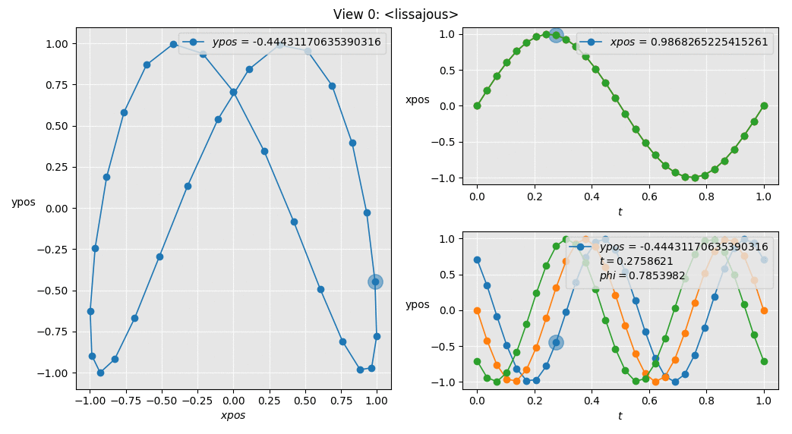

LoopyPlot
=========

Plot data dependencies for scientific and engineering tasks in Python. With ...

> Loo **_py_** Plot ... you can describe your problem in a plain
> [python](https://www.python.org) function
>
> **_Loop_** yPlot ... you can run nested parameter sweeps with data
> dependencies
>
> Loopy **_Plot_** ... you can explore the results by interactive plots
> (many thanks to [matplotlib](https://matplotlib.org/))
>
> **_Loopy_** Plot ... you just configure what you want and everything
> else is done in the background for you


Motivation
----------

In the field of engineering science one common experiment task is to
explore the behavior of a black-box under different inputs. The
black-box can be a pure mathematical function, a numerical algorithm,
the results of a complex simulation or even an experimental measurement.
In many cases the input variation are done by nested for-loops.

While a nested for-loop iteration is simple to code the data management
can be become quite complicated. This is even true when you want

1.  to quickly change the *loop configuration* (nested loops vs. zipped
  loops)
2.  to define *data dependencies* between different experiments
3.  to have an *error recovery* of the loop state because each
  iteration step takes a reasonable amount of time
4.  to *plot* multiple curves preserving the *relations* among each other
5.  to have a *live-update* of all plots while running the loop iteration
6.  to *save* experiment data in a readable and consistent way
7.  to *reload* the interactive plots later from an already finished
   experiment
8.  to write *readable code* which can be shared for collaboration

Especially the last point requires you to split the specific part of
an experiment from its administration (all the seven point above). A very
natural way of splitting is to use a function. Everything inside the
function describes the specific experiment. The function arguments and
return values are used for the administration of the experiment.
In this sense LoopyPlot is a dependency injection (DI) container for
looped functions with the capability of creating interactive plots.


Short Demo
-----------

The following demo shows the basic features of LoopyPlot:

1. Configure the function arguments with loops
2. Run the nested loops
3. Plot the function return values and show the data cursor

*Further information can be found in the
****
which is more detailed.*

We will show the basis features by means of the nice lissajous example.
First of all we need to write the experiment as a python function.
Here we use two sinusoidal functions in order to create the lissajous
curves at the end.

```python
from numpy import pi, cos, sin

def lissajous(t: 's', freq: 'Hz', phi=0):
    xpos: 'cm' = cos(2*pi*freq * t + phi)
    ypos: 'cm' = sin(2*pi * t)
    return xpos, ypos
```

In addition to the plain definition of the sinusoidal functions we can
optionally specify the units of the variables. These unit annotations are
possible thanks the new syntax for variable annotations in python 3.6
and used later for plotting.

In order to explore the behavior of your lissajous function we
sweep the argument `t` and `phi`.

```python
import loopyplot

# (1) create task object from lissajous function and configure the loops
lissajous = loopyplot.Task(lissajous)
lissajous.args.freq.value = 2
lissajous.args.t.sweep(0, 1, num=30)
lissajous.args.phi.iterate(pi/4, pi/2, 3*pi/4)
```

Afterwards we can run the nested double sweep and plot the results.


```python
# (2) run the the configured lissajous task
lissajous.run()

# (3) display the results
lissajous.plot('t', 'xpos')
lissajous.plot('t', 'ypos', row=1, accumulate=[])
lissajous.plot('xpos', 'ypos', row=[0, 1], col=1, squeeze='t', accumulate=[])
```

The matplotlib figure has an interactive data cursor.
You can click at any point (e.g. in the upper left right axes) in order to
update the data cursor and explore the relations between the plots.




Roadmap
-------

Currently, LoopyPlot is ...

* a *prototype* implementation of the seven features listed above, and is
* in *alpha* stage looking for *user feedback*

in order to reach the vision of coding your experiments in a
*readable* and *reuseable* manner. Since LoopyPlot mainly focuses on
experimental measurements speed is not an issue for development
right now.

Open issues before first beta release 0.1:
- [x] improve logging
- [x] refactoring the dependency management (in progress)
- [ ] plotting: add new data points in arbitrary order (not only append),
- [ ] needed for binary sweeps
- [ ] docstings
- [ ] write more tests
- [ ] write more use case demos
- [ ] csv: save arrays in an extra csv file (instead of string encoding)

Further ideas (beyond 0.1):
* implement horizontal nested task lists over vertical looped lists


Install
-------

LoopyPlot is developed under python 3.6
(older versions can be used but are not tested)
and intended to use with an ipython shell `ipython --pylab`
(version 5.6.0 is used for development).

In order instal LoopyPlot, simply download the repository, change into
the folder `LoopyPlot` and

    pip install . --user

If necessary this will automatically install the dependencies:

* matplotlib
* pandas
* numpy


Licence
-------

LoopyPlot is currently licenced under GPL 3. If this licence prevents you
to either use or contribute to LoopyPlot then please feel free to
contact me (&#117;&#115;&#101;&#114;:&#032;&#102;&#114;&#105;&#101;&#100;&#114;&#105;&#099;&#104;&#095;&#104;,&#032;&#115;&#101;&#114;&#118;&#101;&#114;:&#032;&#103;&#109;&#120;&#045;&#100;&#111;&#116;&#045;&#100;&#101;).
It is planed moving to MIT/BSD/Apache/... licence until I understand
the differences :-)
