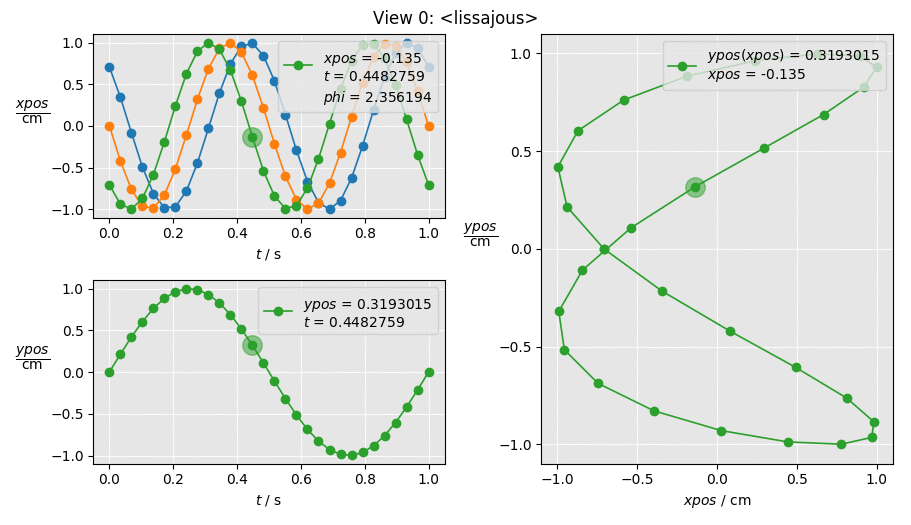

# LoopyPlot
Plot nested loop data for scientific and engineering tasks in Python.

LoopyPlot allows you to concentrate on writing your task in a plain
python function like this

```python
>>> from numpy import pi, cos, sin

>>> def lissajous(t, freq=1, phi=pi/4):
...     x = cos(2*pi*freq * t)
...     y = sin(2*pi * t + phi)
...     return x, y
```

In order to explore the behavior of your sophisticated function by
plotting diffent sweeps you can write

```python
>>> from loopyplot import TaskManager
>>> tm = TaskManager()

>>> task = tm.append(lissajous)
>>> task.args.t.sweep(0, 1, num=25)
>>> task.args.freq.iterate(0.5, 1, 2)
>>> task.args.phi.iterate(pi/2, 0, pi/4)
>>> task.args.phi.zip('freq')

>>> task.plot('t', 'x', col=1, row=0)
>>> task.plot('t', 'y', col=1, row=1)
>>> task.plot('x', 'y', squeeze='t', accumulate='t', row=None)

>>> tm.run()
```

which results in a matplotlib figure with an interactive data cursor



You can click at any data point in order to update the data cursor and explore the relations in your plotted data.
